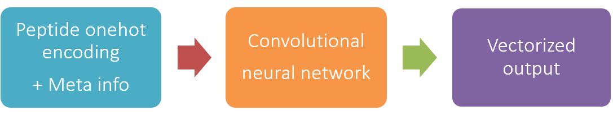
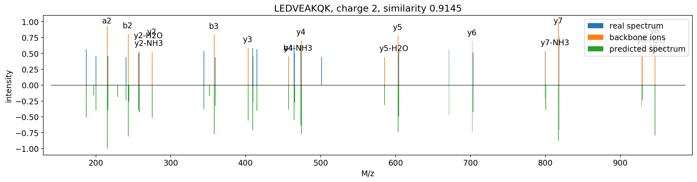
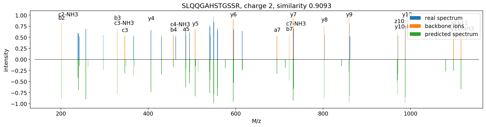

# PredFull

Model for `Full-Spectrum Prediction of Peptides Tandem Mass Spectra using Deep Neural Network`

Kaiyuan Liu, Sujun Li, Lei Wang, Yuzhen Ye, Haixu Tang

## Method

Based on the structure of the residual convolutional networks. Current precision: 0.1 Th.

## How to use

### Required Packages

* Keras >= 2.2.4
* Tensorflow >= 1.12
* Pandas >= 0.20
* pyteomics
* lxml

### Input format

The required input format is TSV, with following columns:

Peptide | Charge | Type | NCE
------- | ------ | ---- | ---
AAAAAAAAAVSR | 2 | HCD | 25
AAGAAESEEDFLR | 2 | HCD | 25
AAPAPTASSTININTSTSK | 2 | HCD | 25

Apparently, 'Peptide' and 'Charge' columns mean what it says. The 'Type' must be HCD or ETD (in uppercase). NCE means normalized collision energy, set to 25 or 30 if you don't care. Check `example.tsv` for examples.

### Usage

Simply run:

`python predfull.py --input .\example.tsv --output .\example.mgf`

The output file is in MGF format

## Prediction Examples

